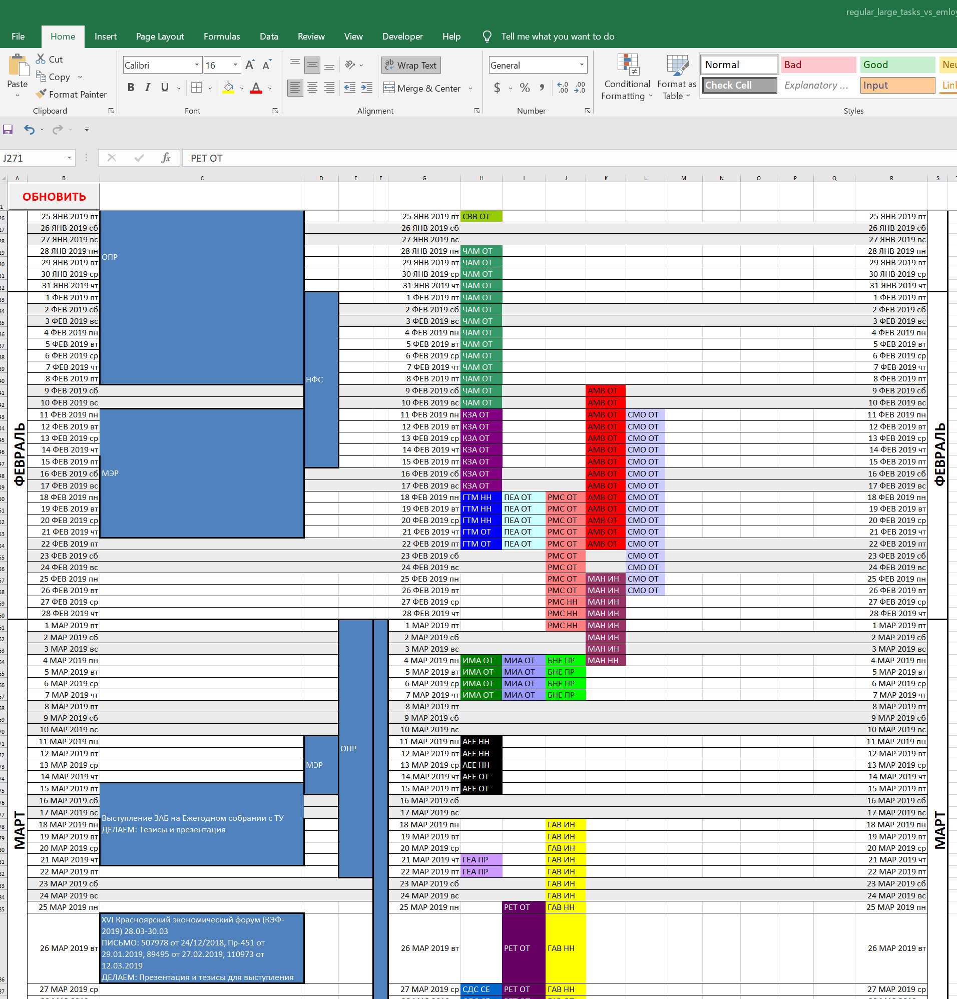
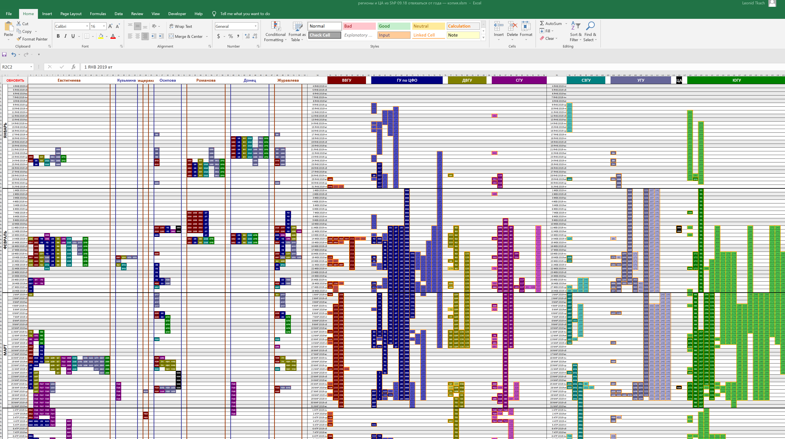
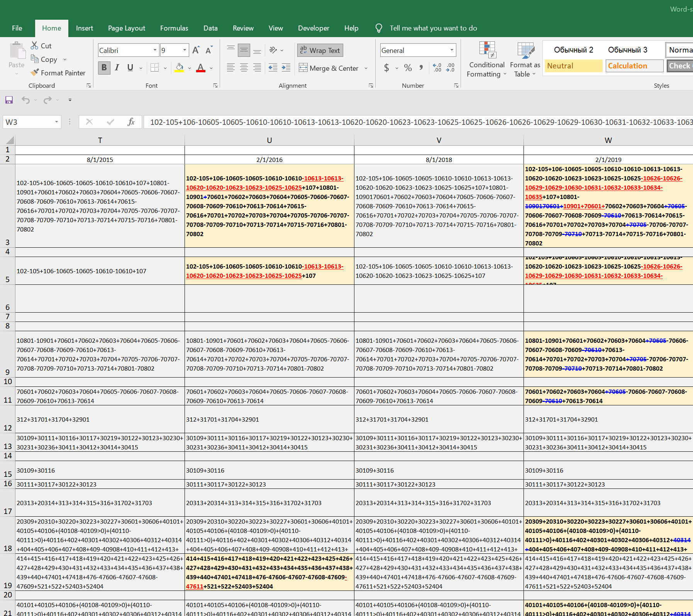
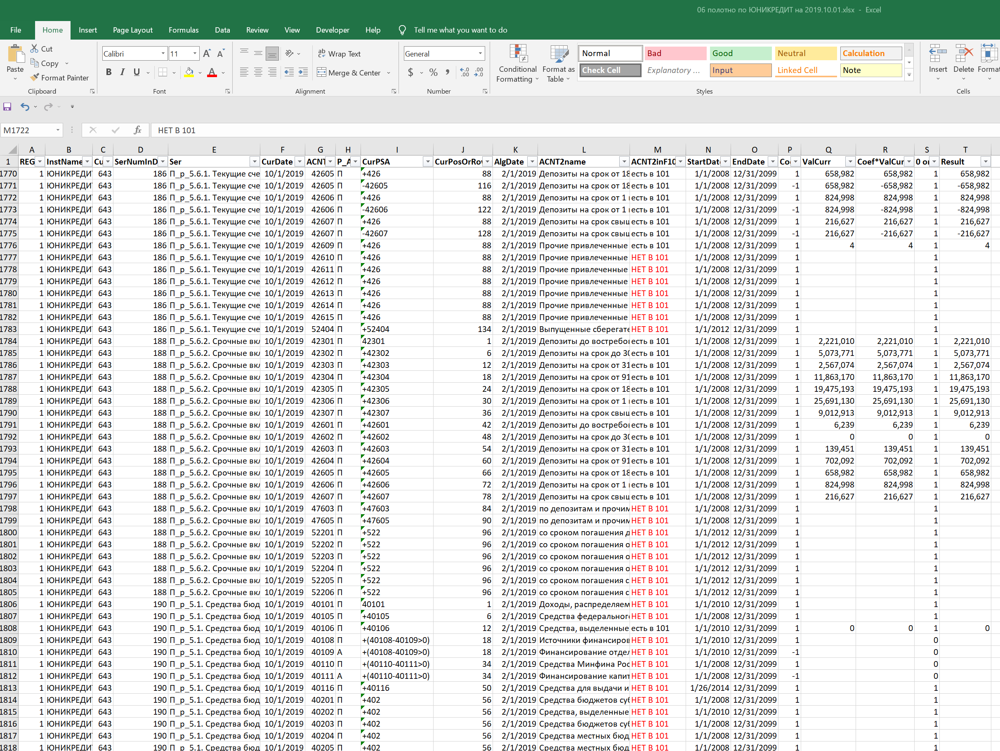

# MS_centric_projects

These are screenshots and xlsm files for some of my projects for the Central Bank of the Russian Federation (Bank of Russia). There is no any data to them. That's why I use screenshots.

## regular_large_tasks_vs_emloyees_vacations

## Supervisors vs supervised events
Regions fill in SharePoint forms about events in their territories. Algorithm is trying to place periods for different events compactly on the right. If the ribbons on the right don't look compact enough, it's obvious that responsible person provided 30-day intervals of when events may happen instead of clarifying several-day periods. It makes it easier to assess event info quality.

Supervisors in the capital accept materials for the events also through SharePoint forms. Their progress is on the left.

## Word-style compare in Excel cell

## Absent data
The algorithm parsers accounting formulas like above, searches for the data in CSVs provided by banks, and aggregates it. This particular sheet shows which pieces of data have not been provided by banks (in red).

