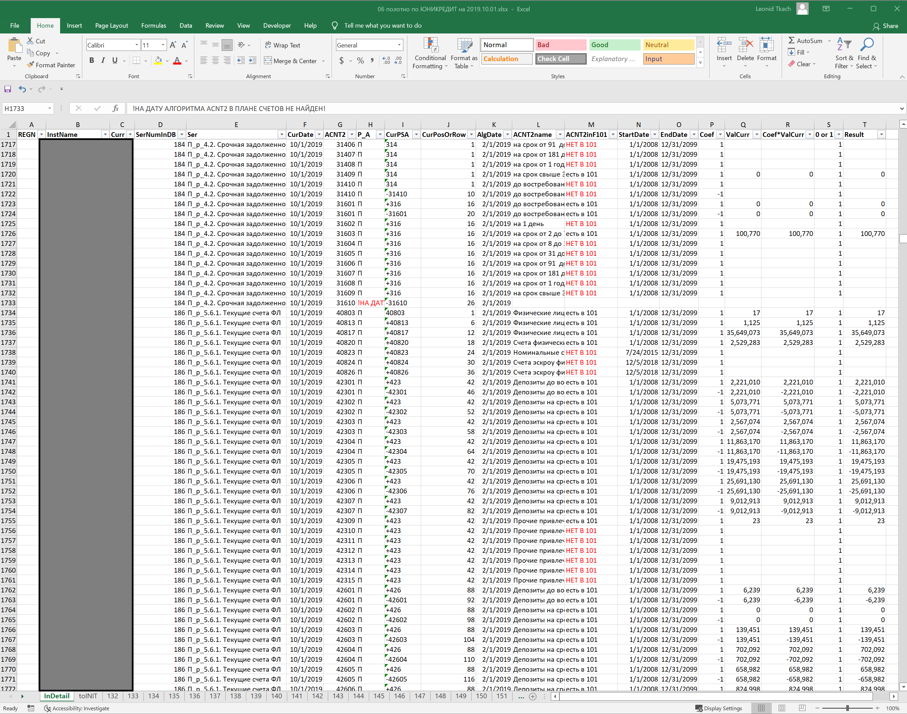

# MS_centric_projects

These are screenshots and xlsm/accdb files for some of my projects for the Central Bank of the Russian Federation (Bank of Russia). I cannot share data to most of them, therefore I use screenshots.

## Regular Large Tasks vs Emloyees Vacations (SharePoint/Excel/VBA)

Staff can track the number of colleagues on leave at a given date and assignments left to complete.

It helps staff to schedule and coordinate their leave time in an efficient manner and without involvement of supervisors.

## Supervisors vs supervised events (SharePoint/Excel/VBA)

Regional offices fill out SharePoint forms on the events held in their regions. The algorithm places the periods for all events compactly on the right. If the ribbons on the right don't look compact enough, it signals that a responsible person has provided 30-day intervals within which the events may take place instead of indicating several-day periods. It facilitates the assessment of event info quality.

Supervisors at the HQ approve data via SharePoint forms. Their progress is on the left.

## Word-style compare in Excel cell (Excel/VBA)

## Absent data
The algorithm parsers accounting formulas from the above screenshot, searches relevant data in CSVs provided by banks, and aggregates it. The below screenshot shows what data is yet to be provided or irrelevant (in red).

## Coverage & Clarity Access DB (Access/SQL/VBA)

The database of communications related to monetary policy stance.

DB interface:

Audience diagram (by quarter, data exported from DB):

